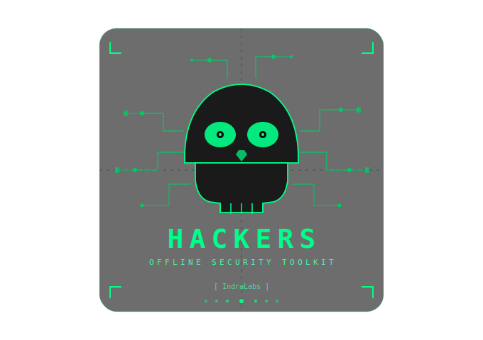

<div align="center">

<!-- Logo -->


# HACKERS

### Offline Security Toolkit

**Une boîte à outils de cybersécurité complète — offline, mobile & desktop**

[](https://flutter.dev)
[](https://dart.dev)
[](LICENSE)
[](https://flutter.dev/multi-platform)
[](CHANGELOG.md)

---

*Développé par **Archange Elie Yatte** — [IndraLabs](https://indralabs.dev)*

</div>

---

## 📖 Table des matières

- [À propos](#-à-propos)
- [Fonctionnalités](#-fonctionnalités)
- [Captures d'écran](#-captures-décran)
- [Prérequis](#-prérequis)
- [Installation](#-installation)
- [Lancer le projet](#-lancer-le-projet)
- [Architecture](#-architecture)
- [Contribuer](#-contribuer)
- [Roadmap](#-roadmap)
- [Licence](#-licence)

---

## 🔥 À propos

**Hackers** est une application **offline-first** destinée aux informaticiens, développeurs et professionnels de la cybersécurité. Elle regroupe **plus de 350 outils techniques** organisés en 15 catégories, accessibles sans aucune connexion internet.

> "Tout ce dont tu as besoin, dans ta poche. Sans connexion. Sans compromis."

### Pourquoi Hackers ?

- **100% offline** — aucune donnée ne quitte ton appareil
- **Multi-plateforme** — Android, iOS, macOS, Windows, Linux
- **Stockage chiffré** — les données sensibles sont protégées localement (AES-256)
- **Outil unique** — remplace des dizaines d'applications et sites web
- **Open source** — transparent, auditable, contributif

---

## ⚡ Fonctionnalités

> 350+ outils répartis en 15 catégories

| # | Catégorie | Nb. d'outils | Highlight |
|---|-----------|:---:|---|
| 1 | 🔐 Cryptographie | 50+ | AES, RSA, ECDSA, ChaCha20, BLAKE3, Ed25519 |
| 2 | 🔑 Password Toolkit | 20+ | Générateur, entropie, Diceware, zxcvbn |
| 3 | 🔄 Encode / Decode | 30+ | Base64, Base58, Morse, Punycode, ROT47 |
| 4 | 📁 File Security | 15+ | Hash fichier, magic bytes, analyse PE/ELF |
| 5 | 🌐 Network Tools | 40+ | CIDR, DNS, Port Scanner, SSL/TLS, iptables |
| 6 | 📶 WiFi Tools | 15+ | RSSI, canal optimal, QR WiFi, WPA3 |
| 7 | 🛠️ Developer Tools | 50+ | JSON, JWT, Regex, Diff, CRON, SQL, UUID |
| 8 | 🔢 Encoding Utilities | 25+ | UUID v7, ULID, OTP, TOTP, PEM↔JWK |
| 9 | 🔍 Forensics Tools | 30+ | EXIF, Hex Dump, Stéganographie, Entropie |
| 10 | 💻 System Tools | 20+ | CPU/RAM, ARP, netstat, audit SSH/sudo |
| 11 | 🕵️ OSINT Tools | 25+ | Dorks, extracteurs, typosquatting, wordlist |
| 12 | 🎨 Steganography Studio | 12+ | LSB, audio, PDF, watermarking |
| 13 | 🧬 Code Analysis | 15+ | Détection secrets, CVE, désobfuscation |
| 14 | 📱 QR Code & Barcode | 12+ | QR, EAN-13, PDF417, export SVG/PNG |
| 15 | 🛡️ Privacy & Anti-Tracking | 15+ | Anonymisation, nettoyeur URLs, fingerprint |

---

## 📸 Captures d'écran

> *(à venir après la première build)*

| Accueil | Cryptographie | Developer Tools |
|---------|--------------|-----------------|
| *soon*  | *soon*       | *soon*          |

---

## 🛠️ Prérequis

Avant de commencer, assure-toi d'avoir installé :

| Outil | Version minimale | Lien |
|-------|:---:|------|
| Flutter SDK | 3.16.0 | [flutter.dev](https://flutter.dev/docs/get-started/install) |
| Dart SDK | 3.2.0 | inclus avec Flutter |
| Android Studio / Xcode | dernière | pour les simulateurs |
| Git | 2.x | [git-scm.com](https://git-scm.com) |

Vérifie ton environnement Flutter :
```bash
flutter doctor
```

---

## 📦 Installation

### 1. Cloner le dépôt

```bash
git clone https://github.com/codelie14/Hackers.git
cd hackers
```

### 2. Installer les dépendances

```bash
flutter pub get
```

### 3. Générer les fichiers Riverpod (code generation)

```bash
dart run build_runner build --delete-conflicting-outputs
```

### 4. Vérifier les assets

Assure-toi que les fichiers suivants sont présents :

```
assets/
├── logo/
│   └── hackers_logo.svg
└── data/
    ├── wordlist_diceware.txt
    └── common_passwords.txt
```

---

## 🚀 Lancer le projet

### Android

```bash
flutter run -d android
```

### iOS

```bash
flutter run -d ios
```

### macOS

```bash
flutter run -d macos
```

### Windows

```bash
flutter run -d windows
```

### Linux

```bash
flutter run -d linux
```

### Build de production

```bash
# Android APK
flutter build apk --release

# Android App Bundle (Play Store)
flutter build appbundle --release

# iOS
flutter build ios --release

# macOS
flutter build macos --release

# Windows
flutter build windows --release

# Linux
flutter build linux --release
```

---

## 🗂️ Architecture

Le projet suit une architecture **Feature-First** avec **Riverpod** pour la gestion d'état.

```
lib/
├── main.dart                    # Point d'entrée
├── app.dart                     # MaterialApp + GoRouter + ProviderScope
│
├── core/                        # Couche transversale
│   ├── theme/                   # ThemeData, couleurs, typographie
│   ├── router/                  # GoRouter — routes de l'app
│   ├── storage/                 # SQLite + flutter_secure_storage
│   └── utils/                   # Helpers globaux
│
├── data/
│   ├── models/                  # Tool, HistoryEntry...
│   └── tools_registry.dart      # Registre des 350+ outils
│
├── features/                    # Un dossier par catégorie
│   ├── crypto/
│   │   ├── providers/           # Riverpod providers
│   │   ├── screens/             # Pages Flutter
│   │   └── widgets/             # Widgets d'outils
│   ├── password/
│   ├── encode_decode/
│   └── ...                      # 15 catégories au total
│
└── shared/
    └── widgets/                 # Composants UI réutilisables
        ├── app_scaffold.dart
        ├── result_box.dart
        ├── copy_button.dart
        └── ...
```

### Packages principaux

| Package | Usage |
|---------|-------|
| `flutter_riverpod` | State management |
| `go_router` | Navigation |
| `pointycastle` | AES, RSA, ECDSA, PBKDF2 |
| `crypto` | MD5, SHA1, SHA256, SHA512, HMAC |
| `cryptography` | ChaCha20, Ed25519, X25519, AES-GCM |
| `flutter_secure_storage` | Stockage chiffré des secrets |
| `sqflite` | Historique local SQLite |
| `qr_flutter` | Génération QR Code |
| `flutter_svg` | Affichage du logo SVG |
| `diff_match_patch` | Outil Diff |

---

## 🤝 Contribuer

Les contributions sont les bienvenues ! Voici comment participer :

### Workflow

```bash
# 1. Fork le projet
# 2. Crée ta branche
git checkout -b feature/nom-de-loutil

# 3. Commit tes changements
git commit -m "feat: ajout outil [NomOutil] dans [Categorie]"

# 4. Push
git push origin feature/nom-de-loutil

# 5. Ouvre une Pull Request
```

### Convention de commits

```
feat:     nouvel outil ou fonctionnalité
fix:      correction de bug
style:    modification UI/UX sans logique
refactor: refactoring sans changement de comportement
docs:     mise à jour documentation
test:     ajout ou modification de tests
```

### Ajouter un nouvel outil

1. Crée le widget dans `lib/features/[categorie]/widgets/`
2. Enregistre-le dans `lib/data/tools_registry.dart`
3. Ajoute la route dans `lib/core/router/app_router.dart`
4. Teste offline (aucun appel réseau non déclaré)

---

## 🗺️ Roadmap

### v2.0 — MVP *(en cours)*
- [x] Architecture Flutter + Riverpod
- [x] Design system dark terminal
- [x] Navigation multi-plateforme
- [ ] Outils Cryptographie (MVP)
- [ ] Outils Password Toolkit (MVP)
- [ ] Outils Encode/Decode (MVP)
- [ ] Outils Developer Tools (MVP)
- [ ] QR Code Generator

### v2.1 — Core Tools
- [ ] Network Tools (CIDR, DNS, Port Scanner)
- [ ] File Security (hash, magic bytes)
- [ ] Forensics (EXIF, Hex Dump, Entropie)
- [ ] System Tools (infos, monitoring)

### v2.2 — Advanced
- [ ] WiFi Tools
- [ ] OSINT Tools
- [ ] Steganography Studio
- [ ] Code Analysis

### v2.3 — Pro
- [ ] Privacy & Anti-Tracking
- [ ] Export / Import chiffré
- [ ] Thèmes personnalisables
- [ ] Raccourcis clavier desktop
- [ ] Plugin system

### v3.0 — Future
- [ ] Sync chiffrée entre appareils (E2E)
- [ ] Scripts automatisés (pipeline d'outils)
- [ ] Mode CLI (desktop)
- [ ] Marketplace de plugins communautaires

---

## 📄 Licence

---

<div align="center">

**Hackers v1.0** — construit avec ❤️ par [Archange Elie Yatte](https://github.com/codelie14) @ [IndraLabs](https://indralabs.dev)

`[ offline. secure. open. ]`

</div>